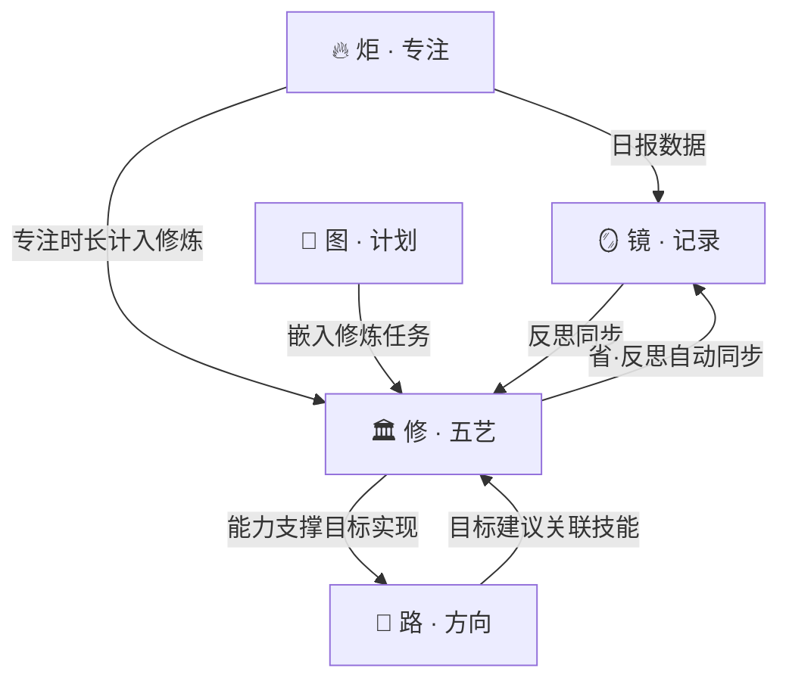
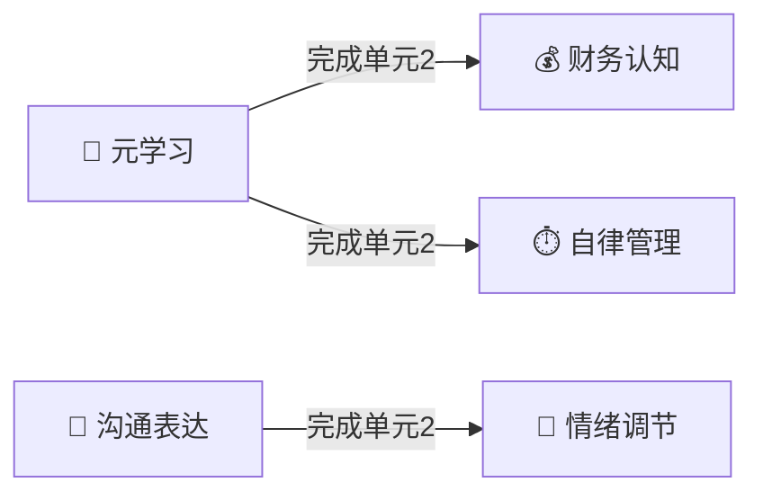

# 「此刻」产品设计文档 v2

> *看见自己，修炼自己，成为自己。*

---

## 一、产品定位

### 一句话定义

**「此刻」是一款帮助迷茫中的人看清自己、修炼底层能力、专注当下的个人成长操作系统。**

### 解决的核心问题

| 问题 | 症状 | 此刻的解法 |
|------|------|-----------|
| 不知道自己在做什么 | 每天很忙但说不清意义 | 🪞 镜 · 记录：每日三问+随时记录 |
| 不知道自己要什么 | 焦虑、频繁切换方向 | 🧭 路 · 方向：北极星目标+蓝图拆解 |
| 注意力被吞噬 | 短视频刷完一整天 | 🔥 炬 · 专注：沉浸计时+注意力守卫 |
| 空有方向没有能力 | 知道该做什么但做不到 | 🏛️ 修 · 五艺：五大底层技能修炼 |

### 产品哲学

```
传统效率工具：你应该做更多 → 焦虑
知识付费平台：你应该学更多 → 囤课不学
短视频平台：  你什么都不用做 → 空虚

此刻：你此刻在做什么？你在修炼什么？→ 清醒 + 成长
```

**三个底层原则：**

| 原则 | 含义 | 具体表现 |
|------|------|----------|
| **少即是多** | 一次只做一件事 | 目标最多3个，每天聚焦一事 |
| **练 > 学** | 练出来的才是你的 | 每个概念都有实操任务和检验标准 |
| **主动 > 被动** | 你创造内容，不被投喂 | 无推荐算法、无信息流、无广告 |

---

## 二、产品架构

### 三层五模块

```
┌─────────────────────────────────────────────────┐
│                   「此刻」                        │
├─────────────────────────────────────────────────┤
│                                                  │
│  第一层：看见自己                                  │
│  ┌──────────────┐  ┌──────────────┐             │
│  │ 🪞 镜 · 记录  │  │ 🧭 路 · 方向  │             │
│  │ 晨间三问      │  │ 北极星目标    │             │
│  │ 随时记录      │  │ 蓝图拆解      │             │
│  │ 夜间回顾      │  │ 本周聚焦      │             │
│  └──────────────┘  └──────────────┘             │
│                                                  │
│  第二层：管理自己                                  │
│  ┌──────────────┐  ┌──────────────┐             │
│  │ 📐 图 · 计划  │  │ 🔥 炬 · 专注  │             │
│  │ 今日一事      │  │ 沉浸计时      │             │
│  │ 任务拆解      │  │ 注意力守卫    │             │
│  │ 复盘机制      │  │ 专注回顾      │             │
│  └──────────────┘  └──────────────┘             │
│                                                  │
│  第三层：修炼自己                                  │
│  ┌──────────────────────────────────────┐       │
│  │        🏛️ 修 · 五艺                   │       │
│  │  🧠元学习  💬沟通  💰财务  🧘情绪  ⏱️自律 │       │
│  └──────────────────────────────────────┘       │
│                                                  │
└─────────────────────────────────────────────────┘
```

### 模块间联动关系



---

## 三、模块一至四（概要）

### 🪞 镜 · 记录

- **晨间三问**：今天最想做成的一件事 / 当前状态 / 困扰
- **随时记录**：💭想法 / ✅行动 / ❓困惑 / 🏛️修炼反思
- **夜间回顾**：目标是否完成 / 最有价值的一刻 / 明天想改变什么
- **周月自省**：AI 汇总模式洞察（不给建议，只帮你"看见"）

### 🧭 路 · 方向

- **北极星目标**：最多 3 个，每个都要写"为什么重要"
- **蓝图拆解**：大目标 → 阶段 → 本周聚焦 → 今日一事
- **技能关联**：设定目标时推荐需要修炼的底层技能

### 📐 图 · 计划

- **今日一事**：首页最醒目位置
- **本周聚焦**：最多 3 件事
- **四象限分类**：重要/紧急矩阵，强调"重要不紧急"
- **周复盘**：每周 15-30 分钟回顾时间分配

### 🔥 炬 · 专注

- **专注计时**：向上计时（无压迫感），深蓝色沉浸界面
- **注意力守卫**：非强制，三层（觉察→提醒→守护）
- **专注回顾**：时长 + 心情 + 反思

---

## 四、模块五：🏛️ 修 · 五艺 — 核心设计

### 设计哲学

> 不是知识付费，不是视频课程，不是碎片化推送。
> 是一套 **「原理 → 方法 → 练习 → 检验」** 的主动修炼系统。

**关键区别：**

| 维度 | 知识付费/在线课程 | 此刻 · 五艺 |
|------|------------------|-------------|
| 学习方式 | 看视频/听音频 | 读概念卡 → 实操练习 → 反思 |
| 内容长度 | 30-60 分钟/节 | 3-5 分钟/概念卡 |
| 验证方式 | 无 / 做题 | 检验标准 + 生活实证 |
| 核心诉求 | 输入知识 | **练出能力** |
| 感觉 | "学了很多" | "做到了" |

### 学习方法论：四步修炼法

每个单元遵循统一的学习闭环：

```
   ┌──────┐    ┌──────┐    ┌──────┐    ┌──────┐
   │ 📖 知 │ →  │ 👁️ 观 │ →  │ 🤸 行 │ →  │ 🪞 省 │
   │ 理解  │    │ 觉察  │    │ 练习  │    │ 反思  │
   │3-5min │    │ 全天  │    │10-20m │    │ 5min │
   └──────┘    └──────┘    └──────┘    └──────┘
       ↑                                    │
       └────────── 下一单元 ←───────────────┘
```

| 步骤 | 做什么 | 为什么 |
|------|--------|--------|
| 📖 **知** | 阅读精炼概念卡（300-500字） | 理解核心原理，不是背知识 |
| 👁️ **观** | 在生活中观察这个概念的实际发生 | 把抽象概念和真实生活连接 |
| 🤸 **行** | 完成一个具体的实践任务 | 练出来的才是你的 |
| 🪞 **省** | 记录心得，自动同步到「镜」 | 复盘是学习的倍增器 |

---

### 技能一：🧠 元学习 — 学会「怎么学」

#### 核心公式

> **学习效率 = 输入质量 × 处理深度 × 输出频率**

#### 四大方法论

| 方法 | 原理 | 怎么练 |
|------|------|--------|
| **费曼技巧** | 讲不清楚 = 没真懂 | 学完立刻用大白话讲给外行听，卡壳的地方就是盲区 |
| **框架先行** | 先有骨架再填肉 | 进入新领域先花1-2h搭骨架（几大模块？核心问题是什么？），再钻细节 |
| **输出倒逼输入** | 输出压力逼你真正理解 | 定期写笔记、做分享、写文章 |
| **刻意练习** | 针对弱点重复 | 对薄弱环节做针对性练习，不是简单重复已会的 |

#### 检验标准

> ✅ **能不看资料、用自己的话把一个新概念讲清楚，并举出例子。**

#### 学习路径（7个单元）

| 单元 | 主题 | 📖 知 | 👁️ 观 | 🤸 行 | 🪞 省 |
|------|------|-------|--------|--------|--------|
| 1 | 学习的本质 | 大脑如何记忆（编码→存储→提取） | 注意今天你学到了什么、怎么学的 | 选一个小话题，25分钟自学并记录过程 | 我习惯的学习方式有效吗？ |
| 2 | 费曼技巧 | 费曼学习法 + 80/20法则 | 找一个完全不懂的领域，10分钟初探 | 学一个新概念，用大白话讲给朋友 | 讲不清楚的部分在哪里？ |
| 3 | 框架先行 | 思维导图、概念图、知识树 | 观察你现有知识是零散还是结构化 | 为正在学的东西画一张知识地图 | 画完后理解有变化吗？ |
| 4 | 有效记忆 | 间隔重复、主动回忆、联想记忆 | 注意今天忘记了什么，为什么忘了 | 选10个重要概念，用间隔重复法复习 | 哪种记忆方法最适合你？ |
| 5 | 深度阅读 | SQ3R阅读法、批注式阅读 | 下次阅读时注意是否在"假装读" | 用SQ3R法读一篇文章/一章书 | 深度阅读和你平时的阅读有什么不同？ |
| 6 | 输出倒逼输入 | 写作即思考、教是最好的学 | 找机会把最近学的讲给别人 | 写一篇"教程"或给朋友讲解一个概念 | 教别人时发现了哪些知识盲区？ |
| 7 | 刻意练习 | 刻意练习vs天真练习、反馈环 | 观察自己哪些学习行为是低效重复 | 选一个弱点做30分钟针对性练习 | 针对性练习和简单重复的区别？ |

---

### 技能二：💬 沟通与表达 — 被理解的力量

#### 核心公式

> **沟通效果 = 对方实际接收到的 ÷ 你想传达的**
>
> （不是你说了什么，而是对方收到了什么）

#### 四大方法论

| 方法 | 原理 | 怎么练 |
|------|------|--------|
| **结构化表达** | 先结论后理由，别让人猜 | 金字塔原理：结论→理由→例子→重申 |
| **倾听复述** | 听懂而不是等着说 | 对方说完后先复述一遍你理解的意思，再回应 |
| **非暴力沟通** | 减少指责引发的冲突 | 四步法：观察事实→表达感受→说明需求→提出请求 |
| **刻意输出** | 量变到质变 | 写日记/文章、做分享、练习即兴表达 |

#### 检验标准

> ✅ **能让不同背景的人都听懂你的意思，冲突场景下依然能理性表达。**

#### 学习路径（8个单元）

| 单元 | 主题 | 📖 知 | 🤸 行（核心练习） |
|------|------|-------|------------------|
| 1 | 倾听的艺术 | 主动倾听vs被动听、3F倾听法 | 一次对话中只听不插嘴，听完复述对方的意思 |
| 2 | 清晰表达 | 金字塔原理、PREP法 | 用 PREP（观点-理由-例子-观点）讲一个想法 |
| 3 | 非暴力沟通 | NVC四步法、"我"语言 | 把一次抱怨改写成 观察→感受→需要→请求 |
| 4 | 说服与影响 | 共情-利益-证据三要素 | 用三要素写一段说服性文字 |
| 5 | 冲突沟通 | 对事不对人、利益导向 | 模拟冲突场景，用"我们"代替"你" |
| 6 | 书面表达 | 简洁写作、故事弧线 | 写300字表达一个观点（限时15分钟） |
| 7 | 公众表达 | 演讲结构、紧张管理 | 对着镜子/录音讲3分钟任意话题 |
| 8 | 提问的力量 | 开放式vs封闭式、苏格拉底式 | 一次对话中只通过提问推进（不给答案） |

---

### 技能三：💰 财务认知 — 让钱为你工作

#### 核心公式

> **财务自由 = f(收支结构, 复利时间)**
>
> 不是赚多少，而是"结构"和"时间"。

#### 四大方法论

| 方法 | 原理 | 怎么练 |
|------|------|--------|
| **记账三个月** | 不记账无从优化 | 搞清楚钱去哪了，分类必要/想要/浪费 |
| **三账户思维** | 分开管理降低风险 | 应急金（3-6月开支）+ 投资账户 + 消费账户 |
| **基础投资常识** | 避免被割韭菜 | 懂资产配置、复利公式、风险收益关系 |
| **控制负债** | 区分好债和坏债 | Good debt（增值型：教育/创业）vs Bad debt（纯消费） |

#### 检验标准

> ✅ **能说清自己每月收支去向，有应急金，不被高息诱惑冲昏头。**

#### 学习路径（7个单元）

| 单元 | 主题 | 📖 知 | 🤸 行（核心练习） |
|------|------|-------|------------------|
| 1 | 钱的本质 | 货币、通胀、购买力 | 记录今天所有支出，分成"必要/想要/浪费" |
| 2 | 收支管理 | 50/30/20法则、现金流思维 | 制定下月预算计划 |
| 3 | 复利思维 | 复利公式、72法则 | 计算每月存X元10年后的金额 |
| 4 | 风险与保障 | 保险本质、应急基金 | 评估"失业3个月会怎样"，计算应急金需求 |
| 5 | 投资入门 | 资产类型、风险收益关系 | 模拟投资1万元，选择组合并写下理由 |
| 6 | 消费心理学 | 锚定效应、沉没成本、延迟满足 | 想买东西时等24小时再决定 |
| 7 | 三账户落地 | 账户架构设计、自动化储蓄 | 开设三个账户，设定自动转账规则 |

---

### 技能四：🧘 情绪调节 — 内心的定力

#### 核心公式

> **情绪本身不是问题，被情绪支配下的"自动反应"才是问题。**

#### 四大方法论

| 方法 | 原理 | 怎么练 |
|------|------|--------|
| **命名情绪** | 命名本身就有降温作用 | 情绪上来时先停下问"我现在具体是什么感受"（愤怒？委屈？焦虑？） |
| **延迟反应** | 不在情绪顶峰做决定 | 情绪强烈时给自己暂停期（深呼吸10次或走开5分钟） |
| **溯源练习** | 情绪的靶子≠真正的源头 | 定期复盘"这个情绪从哪来的"，找到真实触发源 |
| **身体调节** | 情绪问题往往先是身体问题 | 运动、睡眠、呼吸训练是最直接的情绪基础设施 |

#### 检验标准

> ✅ **遇到刺激事件时，能觉察到情绪而不是被情绪直接带着做反应。**

#### 学习路径（7个单元）

| 单元 | 主题 | 📖 知 | 🤸 行（核心练习） |
|------|------|-------|------------------|
| 1 | 认识你的情绪 | 基本情绪、情绪轮、身体信号 | 今天每2小时暂停一次，问"我现在什么情绪" |
| 2 | 情绪的来源 | ABC理论（事件→信念→情绪） | 写一个不开心的事，分析A-B-C三层 |
| 3 | 命名与降温 | 情绪标签化、6秒暂停法 | 下次情绪上来时先命名它，深呼吸6次再回应 |
| 4 | 焦虑应对 | 控制圈/影响圈/关注圈 | 列出所有焦虑，分类到三个圈，对可控的立刻行动 |
| 5 | 正念基础 | 不评判地觉察当下 | 做一次5分钟呼吸冥想 |
| 6 | 韧性与复原力 | 成长型vs固定型思维 | 用成长型思维重新解读一次失败经历 |
| 7 | 情绪与关系 | 情绪传染、边界意识 | 一次对话中练习"共情但不吸收对方情绪" |

---

### 技能五：⏱️ 自律与时间管理 — 掌控你的生活

#### 核心公式

> **自律不是靠意志力硬扛，而是靠系统设计减少对意志力的依赖。**

#### 四大方法论

| 方法 | 原理 | 怎么练 |
|------|------|--------|
| **要事优先** | 先做重要不紧急的 | 四象限法每天筛选任务，优先做第二象限 |
| **环境设计** | 减少诱惑路径 | 把手机放另一个房间，而不是靠"忍住不刷" |
| **最小启动** | 降低启动门槛 | 任务拆到"5分钟就能开始"的粒度 |
| **复盘机制** | 持续校准方向 | 每周15-30分钟回顾时间用在哪、哪些真正有价值 |

#### 检验标准

> ✅ **不需要靠"deadline逼近的焦虑"也能推进重要但不紧急的事情。**

#### 学习路径（7个单元）

| 单元 | 主题 | 📖 知 | 🤸 行（核心练习） |
|------|------|-------|------------------|
| 1 | 时间去哪了 | 时间审计、帕金森定律 | 今天每小时记录一次你在做什么，做时间审计 |
| 2 | 重要vs紧急 | 艾森豪威尔矩阵 | 把今天的事放进四象限，优先做"重要不紧急" |
| 3 | 最小启动 | 2分钟法则、启动成本 | 找一件拖延的事，用"先做5分钟"启动它 |
| 4 | 习惯设计 | 习惯回路（提示→惯常→奖励） | 设计一个新习惯，从极小行动开始坚持3天 |
| 5 | 环境设计 | 默认选项、选择架构 | 修改一个环境细节来降低自律门槛 |
| 6 | 精力管理 | 精力四象限、休息的艺术 | 把最重要任务安排在精力最高的时段 |
| 7 | 系统而非意志力 | 自动化、承诺机制 | 设计一套不依赖意志力的个人系统 |

---

## 五、五艺解锁与进度体系

### 解锁机制



| 技能 | 解锁条件 | 理由 |
|------|----------|------|
| 🧠 元学习 | 默认开放 | 学习能力是一切的基础 |
| 💬 沟通表达 | 默认开放 | 被理解是生存的基本需求 |
| 💰 财务认知 | 完成元学习单元2 | 需要"框架先行"能力来理解财务体系 |
| 🧘 情绪调节 | 完成沟通表达单元2 | 需要"倾听与表达"能力来做自我对话 |
| ⏱️ 自律管理 | 完成元学习单元2 | 需要"学习方法"来建立有效的习惯系统 |

### 修炼等级

每项技能根据完成的单元数显示等级：

```
初心  ░░░░░░░░░░  0%     尚未开始
入门  ██░░░░░░░░  ~25%   完成前2个单元
进阶  █████░░░░░  ~50%   完成一半单元
通达  ████████░░  ~75%   完成大部分
精通  ██████████  100%   全部完成并通过检验
```

### 检验机制

精通不是"做完了"，而是**通过检验标准**。每项技能最后一个单元是「检验关」：

| 技能 | 检验关内容 |
|------|-----------|
| 🧠 元学习 | 选一个从未接触的领域，48小时内做出一个清晰的概念讲解 |
| 💬 沟通表达 | 完成一次即兴3分钟表达 + 一次冲突场景的NVC练习 |
| 💰 财务认知 | 提交你的三账户规划 + 月度收支分析 |
| 🧘 情绪调节 | 记录一周的情绪日志，分析模式和溯源 |
| ⏱️ 自律管理 | 展示你设计的"不靠意志力"的个人系统 |

---

## 六、交互设计要点

### 底部导航（5 Tab）

```
┌──────────────────────────────────────────┐
│   🏠       🪞       🧭      🏛️      🔥  │
│   此刻      镜       路      修       炬  │
└──────────────────────────────────────────┘
```

### 首页布局

```
┌──────────────────────────────────────┐
│                                      │
│    下午好                            │
│    9月23日 周二                       │
│                                      │
│    ─ ─ ─ ─ ─ ─ ─ ─ ─ ─              │
│                                      │
│    ⭐ 今日一事                        │
│    完成 Figma 第 6 课                 │
│    [ 🔥 开始专注 ]                    │
│                                      │
│    ─ ─ ─ ─ ─ ─ ─ ─ ─ ─              │
│                                      │
│    🏛️ 今日修炼                        │
│    🧠 元学习 · 单元3 · 👁️观察中       │
│    "观察你现有知识是零散还是结构化"    │
│    [ 继续修炼 ]                       │
│                                      │
│    ─ ─ ─ ─ ─ ─ ─ ─ ─ ─              │
│                                      │
│    💭 最近记录                        │
│    "今天上午状态不错..."              │
│    — 2小时前                          │
│                                      │
└──────────────────────────────────────┘
```

> [!IMPORTANT]
> 首页新增 **「今日修炼」** 卡片，展示当前正在进行的修炼进度，降低学习的启动成本。

### 五艺首页

```
┌──────────────────────────────────────┐
│                                      │
│    🏛️ 修 · 五艺                      │
│    人生的底层操作系统                  │
│                                      │
│    ┌────────────────────────────────┐│
│    │ 🧠 元学习 · 学会怎么学         ││
│    │ 核心：效率=输入质量×处理深度    ││
│    │      ×输出频率               ││
│    │ 单元 3/7  ████████░░  进阶    ││
│    │ [ 继续修炼 ]                  ││
│    └────────────────────────────────┘│
│                                      │
│    ┌────────────────────────────────┐│
│    │ 💬 沟通表达 · 被理解的力量      ││
│    │ 核心：效果=对方收到的÷你想     ││
│    │      传达的                   ││
│    │ 单元 1/8  ██░░░░░░░░  入门    ││
│    │ [ 继续修炼 ]                  ││
│    └────────────────────────────────┘│
│                                      │
│    ┌────────────────────────────────┐│
│    │ 💰 财务认知 · 让钱为你工作      ││
│    │ 🔒 完成「元学习」单元2后解锁   ││
│    └────────────────────────────────┘│
│                                      │
│    ┌────────────────────────────────┐│
│    │ 🧘 情绪调节 · 内心的定力        ││
│    │ 🔒 完成「沟通表达」单元2后解锁  ││
│    └────────────────────────────────┘│
│                                      │
│    ┌────────────────────────────────┐│
│    │ ⏱️ 自律管理 · 掌控你的生活      ││
│    │ 🔒 完成「元学习」单元2后解锁   ││
│    └────────────────────────────────┘│
│                                      │
└──────────────────────────────────────┘
```

### 概念卡片设计原则

| 原则 | 要求 | 反面 |
|------|------|------|
| **精炼** | 300-500字，一个核心概念 | 长篇大论 |
| **有温度** | 像朋友在聊天 | 教科书说教 |
| **有公式** | 每个概念给一个可记忆的公式/模型 | 散文式论述 |
| **可行动** | 读完就知道"接下来做什么" | 纯理论 |
| **接地气** | 生活中的例子 | 抽象概念堆砌 |

---

## 七、视觉设计

### 配色

```
主色调：温暖米白 #FAF6F1（纸张感）
文字色：深棕灰 #3D3530（柔和，非纯黑）
强调色：琥珀色 #D4A574（温暖、克制）
专注色：深靛蓝 #2C3E6B（沉静）
成功色：森林绿 #5B8C6F（生长、希望）
修炼色：紫檀色 #8B6F6F（沉稳、积淀）
```

### 设计原则

| 原则 | 表现 |
|------|------|
| 呼吸感 | 大量留白，元素间距宽松 |
| 一屏一事 | 每页只做一件事 |
| 温暖人文 | 用文字传递信息，像朋友说话 |
| 无通知打扰 | 默认零推送 |
| 无无限滚动 | 所有内容有明确边界 |

---

## 八、商业模式

| 版本 | 价格 | 内容 |
|------|------|------|
| 🌱 免费版 | ¥0 | 镜·记录 + 路·方向 + 炬·专注 + 五艺各前2单元 |
| 🌳 成长版 | ¥28/月 或 ¥258/年 | 五艺完整内容 + 多设备同步 + AI自省报告 |
| 🌲 终身版 | ¥648 买断 | 成长版全部功能，终身更新 |

> 不做广告。一个帮你对抗注意力经济的产品，不能自己就是注意力经济的一部分。

---

## 九、MVP 分期规划

### Phase 1（已完成 ✅）：核心体验

镜·记录 + 路·方向 + 炬·专注 + 首页

### Phase 2（下一步）：五艺系统

- 五艺首页、技能详情页、单元学习页
- 概念卡片内容（5技能 × 7-8单元 × 4步骤 ≈ 150张卡片）
- 修炼进度追踪
- 解锁机制
- 与「镜」模块联动（反思同步）

### Phase 3：智能化

- AI 自省报告（周/月）
- 注意力守卫（屏幕时间感知）
- 智能推荐修炼内容
- 蓝图计划系统

### Phase 4：生态化

- 多端同步
- 数据导出（Markdown）
- Flutter 移动端
- 社区功能（可选，克制的）

---

> *「此刻」—— 不催你快，不逼你卷。帮你看清自己，修炼自己，一次做好一件事。*
