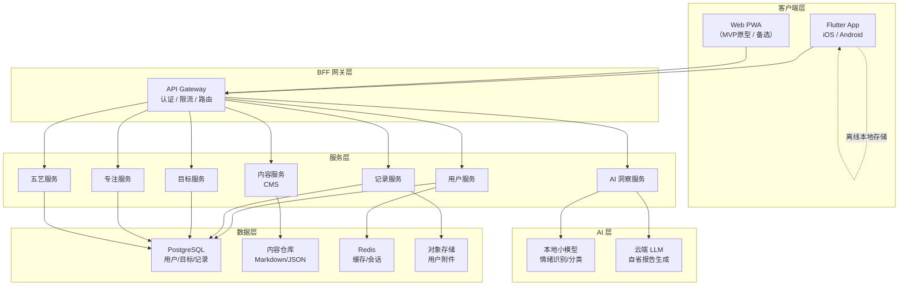
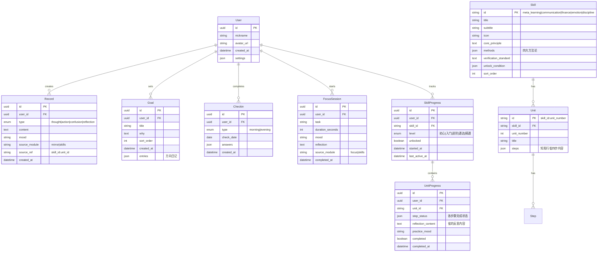
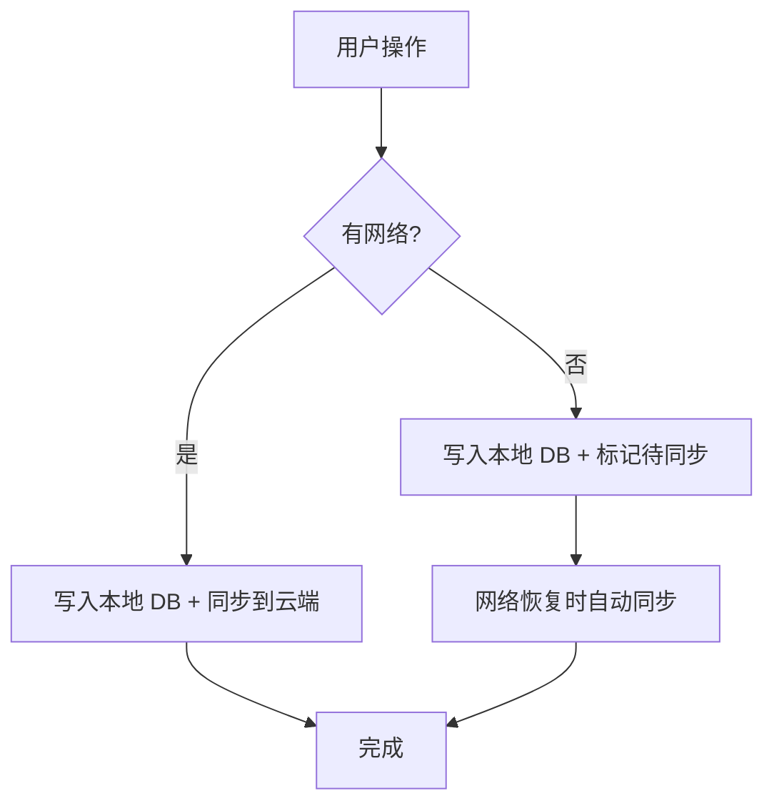
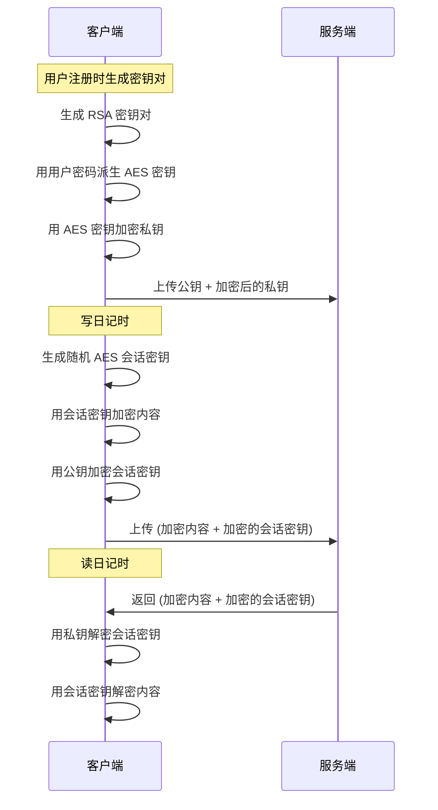

# 「此刻」技术架构方案

---

## 一、架构总览



### 核心技术选型

| 层次 | 技术选型 | 选型理由 |
|------|----------|----------|
| **移动端** | Flutter (Dart) | 一套代码覆盖 iOS/Android，性能接近原生，UI 表现力强 |
| **Web 端** | Flutter Web / 纯 HTML（MVP） | 复用 Flutter 代码或轻量原型 |
| **后端** | Go / Node.js（按团队技能选） | Go 高性能低资源；Node.js 开发速度快 |
| **数据库** | PostgreSQL | 成熟稳定、JSONB 支持灵活存储 |
| **缓存** | Redis | 会话管理、热点数据缓存 |
| **对象存储** | 阿里 OSS / AWS S3 | 用户上传的图片等附件 |
| **内容管理** | Git 仓库 + Markdown | 概念卡片内容版本化管理 |
| **AI** | 端侧 ONNX + 云端 API | 简单分析本地，复杂洞察云端 |

---

## 二、数据模型设计

### ER 图



### 关键字段说明

**Record.source_module + source_ref**
- 记录来源追踪。五艺中的「省·反思」自动生成 Record，`source_module='skills'`，`source_ref='meta_learning:3'`（元学习第3单元）
- 支持在「镜」中按来源筛选

**Skill.unlock_condition**
```json
// 财务认知的解锁条件
{
  "type": "unit_completed",
  "skill_id": "meta_learning",
  "unit_number": 2
}
```

**Unit.steps**
```json
{
  "know": {
    "title": "费曼学习法 + 80/20法则",
    "content": "概念卡片内容（Markdown）",
    "estimated_minutes": 5
  },
  "observe": {
    "title": "找一个完全不懂的领域，10分钟初探",
    "prompt": "今天你观察到了什么？",
    "estimated_minutes": null
  },
  "practice": {
    "title": "学一个新概念，用大白话讲给朋友",
    "tips": ["选你感兴趣的话题", "不用准备，直接讲"],
    "estimated_minutes": 15
  },
  "reflect": {
    "title": "讲不清楚的部分在哪里？",
    "prompt": "这次练习你有什么发现？",
    "sync_to_mirror": true
  }
}
```

**UnitProgress.step_status**
```json
{
  "know": { "completed": true, "completed_at": "2026-09-23T10:00:00Z" },
  "observe": { "completed": true, "note": "发现自己...", "completed_at": "2026-09-23T18:00:00Z" },
  "practice": { "completed": false },
  "reflect": { "completed": false }
}
```

---

## 三、内容管理系统（CMS）

五艺内容是产品核心资产，需要独立管理。

### 内容存储方案

```
content/
├── skills/
│   ├── meta_learning/           # 🧠 元学习
│   │   ├── skill.json           # 技能元数据（原理、方法论、检验标准）
│   │   ├── unit_1/
│   │   │   ├── unit.json        # 单元元数据
│   │   │   ├── know.md          # 📖 知 · 概念卡片（Markdown）
│   │   │   ├── observe.json     # 👁️ 观 · 觉察任务
│   │   │   ├── practice.json    # 🤸 行 · 练习任务
│   │   │   └── reflect.json     # 🪞 省 · 反思提示
│   │   ├── unit_2/
│   │   │   └── ...
│   │   └── unit_7/
│   │       └── ...
│   ├── communication/           # 💬 沟通表达
│   │   └── ...
│   ├── finance/                 # 💰 财务认知
│   │   └── ...
│   ├── emotion/                 # 🧘 情绪调节
│   │   └── ...
│   └── discipline/              # ⏱️ 自律管理
│       └── ...
└── version.json                 # 内容版本号
```

### skill.json 示例

```json
{
  "id": "meta_learning",
  "title": "元学习",
  "subtitle": "学会怎么学",
  "icon": "🧠",
  "core_principle": "学习效率 = 输入质量 × 处理深度 × 输出频率",
  "methods": [
    {
      "name": "费曼技巧",
      "principle": "讲不清楚 = 没真懂",
      "practice": "学完立刻用大白话讲给外行听，卡壳的地方就是盲区"
    },
    {
      "name": "框架先行",
      "principle": "先有骨架再填肉",
      "practice": "进入新领域先花1-2h搭骨架（几大模块？核心问题？），再钻细节"
    },
    {
      "name": "输出倒逼输入",
      "principle": "输出压力逼你真正理解",
      "practice": "定期写笔记、做分享、写文章"
    },
    {
      "name": "刻意练习",
      "principle": "针对弱点重复",
      "practice": "对薄弱环节做针对性练习，不是简单重复已会的"
    }
  ],
  "verification_standard": "能不看资料、用自己的话把一个新概念讲清楚，并举出例子。",
  "unlock_condition": null,
  "total_units": 7,
  "sort_order": 1
}
```

### know.md 概念卡片示例

```markdown
---
title: 费曼学习法
estimated_minutes: 5
---

# 费曼学习法

物理学家费曼说过一句话——

> "如果你不能简单地解释它，说明你还不够理解它。"

这就是费曼技巧的核心：**用教别人的方式检验自己是否真懂。**

## 怎么做？

1. **选择一个概念**——你刚学的、你以为懂了的
2. **假装给一个小学生讲**——不用术语，只用大白话
3. **卡壳了？** 太好了——这就是你的知识盲区
4. **回去补上那个洞**，然后再讲一次

## 为什么有效？

大多数人的"学会了"其实是"看懂了"。
看懂 ≠ 会用 ≠ 能讲清楚。

费曼技巧强迫你从"被动理解"切换到"主动输出"，
这个切换过程会暴露所有你以为懂但其实模糊的地方。

## 80/20 法则

一个新领域 80% 的价值来自 20% 的核心概念。
先找到那 20%，用费曼技巧把它们吃透，
比从头到尾读完一本 300 页的书有效得多。

---

> 💡 记住：**讲不清楚 = 没真懂**。这不是丢人，这是学习的最大加速器。
```

### 内容更新策略

| 策略 | 实现 |
|------|------|
| **版本化** | 内容仓库用 Git 管理，每次更新打版本标签 |
| **增量同步** | 客户端记录已下载的内容版本，只拉取增量 |
| **离线优先** | 首次安装时打包核心内容（Phase 1 全部5技能内容），后续增量更新 |
| **内容审核** | 所有概念卡片需经过产品和专业人士审核后发布 |

---

## 四、前端架构（Flutter）

### 项目结构

```
lib/
├── main.dart                    # 入口
├── app/
│   ├── app.dart                 # MaterialApp 配置
│   ├── router.dart              # GoRouter 路由定义
│   └── theme.dart               # 设计系统主题
├── core/
│   ├── constants/               # 常量定义
│   ├── utils/                   # 工具函数
│   ├── extensions/              # Dart 扩展方法
│   └── di/                      # 依赖注入（GetIt）
├── data/
│   ├── models/                  # 数据模型
│   │   ├── record.dart
│   │   ├── goal.dart
│   │   ├── checkin.dart
│   │   ├── focus_session.dart
│   │   ├── skill.dart
│   │   ├── unit.dart
│   │   └── progress.dart
│   ├── repositories/            # 数据仓库
│   │   ├── record_repo.dart
│   │   ├── goal_repo.dart
│   │   ├── skill_repo.dart
│   │   └── sync_repo.dart
│   ├── local/                   # 本地存储
│   │   ├── database.dart        # Drift (SQLite)
│   │   └── preferences.dart     # SharedPreferences
│   ├── remote/                  # 远程 API
│   │   └── api_client.dart
│   └── content/                 # 内容解析
│       ├── content_loader.dart  # 加载概念卡片
│       └── markdown_parser.dart # Markdown → Widget
├── features/                    # 按功能模块
│   ├── home/                    # 🏠 首页
│   ├── mirror/                  # 🪞 镜
│   │   ├── pages/
│   │   ├── widgets/
│   │   └── bloc/
│   ├── direction/               # 🧭 路
│   ├── focus/                   # 🔥 炬
│   └── skills/                  # 🏛️ 修 · 五艺
│       ├── pages/
│       │   ├── skills_home.dart      # 五艺首页
│       │   ├── skill_detail.dart     # 技能详情
│       │   ├── unit_learning.dart    # 单元学习
│       │   ├── concept_card.dart     # 概念卡片阅读
│       │   ├── practice_task.dart    # 实践任务
│       │   └── reflection.dart       # 反思页面
│       ├── widgets/
│       │   ├── skill_card.dart
│       │   ├── progress_ring.dart
│       │   ├── step_indicator.dart
│       │   └── method_card.dart
│       └── bloc/
│           ├── skills_bloc.dart
│           └── unit_bloc.dart
└── shared/
    └── widgets/                 # 通用组件
        ├── mood_selector.dart
        ├── cike_card.dart
        ├── cike_button.dart
        └── bottom_nav.dart
```

### 状态管理

| 选型 | 使用场景 |
|------|----------|
| **flutter_bloc** | 页面级状态（修炼进度、记录列表） |
| **Provider** | 全局状态（用户信息、主题） |
| **ValueNotifier** | 组件级状态（计时器、表单） |

### 离线优先策略



- 所有数据操作先写入本地 SQLite（Drift ORM）
- 网络可用时后台同步
- 冲突解决策略：Last-Write-Wins + 时间戳

### 关键依赖包

| 包 | 用途 |
|---|------|
| `go_router` | 声明式路由 |
| `flutter_bloc` | 状态管理 |
| `drift` | SQLite ORM |
| `dio` | HTTP 客户端 |
| `get_it` + `injectable` | 依赖注入 |
| `flutter_markdown` | 概念卡片渲染 |
| `fl_chart` | 进度可视化 |
| `encrypt` | 端到端加密 |

---

## 五、后端架构

### 服务划分

MVP 阶段采用**单体架构 + 模块化**，后期可按需拆分微服务。

```
server/
├── cmd/
│   └── api/main.go              # 入口
├── internal/
│   ├── handler/                 # HTTP 处理器
│   │   ├── auth.go
│   │   ├── record.go
│   │   ├── goal.go
│   │   ├── checkin.go
│   │   ├── focus.go
│   │   ├── skill.go             # 五艺相关 API
│   │   └── sync.go
│   ├── service/                 # 业务逻辑
│   ├── repository/              # 数据访问
│   ├── model/                   # 数据模型
│   └── middleware/              # 中间件（认证、限流、日志）
├── pkg/
│   ├── crypto/                  # 加密工具
│   └── content/                 # 内容加载
└── content/                     # 五艺内容文件（同 CMS 结构）
```

### 核心 API 设计

```
# 认证
POST   /api/v1/auth/register
POST   /api/v1/auth/login
POST   /api/v1/auth/refresh

# 记录
GET    /api/v1/records                     # 列表（分页、筛选）
POST   /api/v1/records                     # 创建
GET    /api/v1/records/recent?limit=5      # 最近 N 条

# 签到
GET    /api/v1/checkins/today/:type        # 今日签到
POST   /api/v1/checkins                    # 提交签到

# 目标
GET    /api/v1/goals                       # 列表（最多3个）
POST   /api/v1/goals                       # 创建
PUT    /api/v1/goals/:id                   # 更新

# 专注
POST   /api/v1/focus/sessions              # 保存专注记录
GET    /api/v1/focus/stats?period=today    # 统计

# 五艺
GET    /api/v1/skills                      # 技能列表（含解锁状态）
GET    /api/v1/skills/:id                  # 技能详情（含方法论）
GET    /api/v1/skills/:id/units            # 单元列表
GET    /api/v1/skills/:id/units/:num       # 单元详情（含四步内容）
GET    /api/v1/skills/:id/units/:num/content/:step  # 概念卡片内容

# 五艺进度
GET    /api/v1/progress/skills             # 全部技能进度
PUT    /api/v1/progress/skills/:id/units/:num/steps/:step  # 更新步骤状态
GET    /api/v1/progress/dashboard          # 修炼总览

# 同步
POST   /api/v1/sync/push                  # 客户端 → 服务端
GET    /api/v1/sync/pull?since=<timestamp> # 服务端 → 客户端

# 内容版本
GET    /api/v1/content/version             # 当前内容版本
GET    /api/v1/content/update?from=<ver>   # 增量内容更新
```

---

## 六、AI 集成方案

### 分层处理

| 层级 | 运行位置 | 功能 | 模型 |
|------|----------|------|------|
| L1 本地 | 客户端 | 情绪分类、关键词提取 | ONNX 小模型（<50MB） |
| L2 云端 | 服务器 | 周/月自省报告生成 | 通义千问 / GPT-4o-mini |
| L3 云端 | 服务器 | 修炼建议、学习路径个性化 | GPT-4o / Claude |

### AI 自省报告

**输入**：用户一周/一月的记录、签到、修炼进度
**输出**：结构化洞察（不给建议，只帮"看见"）

```json
{
  "period": "2026-09-16 ~ 2026-09-22",
  "patterns": [
    "你这周写了12条记录，其中7条和「职业方向」相关——看起来这是你最在意的事",
    "你记录了5次困惑，3次关于「时间不够用」——也许可以重新看看你的计划"
  ],
  "mood_trend": "周三最低，周六最高——注意到了吗？",
  "skill_insight": "你本周在「元学习」上花了3次专注时间，但「沟通表达」还没开始——是时候了吗？",
  "focus_summary": "本周专注总时长5小时23分钟，比上周多了1小时"
}
```

### AI Prompt 设计原则

> [!CAUTION]
> AI 的角色是**镜子**，不是**导师**。

```
你是「此刻」App 的自省助手。
你的职责是帮助用户"看见"自己的模式和趋势。

规则：
1. 只陈述观察到的事实和模式，不给具体建议
2. 用温暖、平等的语气，像朋友聊天
3. 提出开放式问题引发思考，不下结论
4. 永远不评判用户的行为
5. 使用用户自己写的原文做引用，增加共鸣感
```

---

## 七、安全与隐私

### 隐私架构

| 层面 | 措施 |
|------|------|
| **传输** | 全链路 HTTPS/TLS 1.3 |
| **存储** | 服务端数据库字段级加密（AES-256） |
| **端到端** | 日记内容 E2EE，服务端只存密文 |
| **本地** | SQLite 数据库加密（SQLCipher） |
| **认证** | JWT + Refresh Token，支持生物识别 |
| **数据主权** | 完整导出（Markdown ZIP）、一键删除 |

### E2EE 流程



---

## 八、性能策略

| 场景 | 策略 |
|------|------|
| 首次加载 | 五艺内容随 App 打包，无需网络即可使用 |
| 概念卡片 | Markdown 预解析为 Widget 树并缓存 |
| 记录列表 | 分页加载 + 虚拟列表 |
| 专注计时 | 前台 Timer + 后台 Isolate，保证计时精度 |
| 数据同步 | 增量同步 + 批量压缩 + 断点续传 |
| 图片 | 客户端压缩后上传，CDN 分发 |

---

## 九、监控与可观测性

| 维度 | 工具 | 关注指标 |
|------|------|----------|
| 崩溃 | Sentry / Firebase Crashlytics | 崩溃率 < 0.1% |
| 性能 | Firebase Performance | 启动时间 < 2s，页面切换 < 300ms |
| 业务 | 自建埋点 | 晨间签到完成率、五艺单元完成率、留存 |
| 后端 | Prometheus + Grafana | API 响应时间 P99 < 500ms |

### 核心业务指标

| 指标 | 定义 | 目标 |
|------|------|------|
| 晨间签到率 | 每日活跃用户中完成晨间三问的比例 | > 60% |
| 修炼活跃率 | 周活跃用户中本周有修炼行为的比例 | > 40% |
| 单元完成率 | 开始一个单元后完成全部4步的比例 | > 50% |
| 7日留存 | 注册7天后仍活跃 | > 35% |
| 30日留存 | 注册30天后仍活跃 | > 20% |

---

## 十、开发排期建议

### Phase 2: 五艺系统（预估 10-12 周）

| 阶段 | 周数 | 交付物 |
|------|------|--------|
| 内容创作 | W1-W4 | 5技能 × 7-8单元 × 概念卡片 ≈ 150 张卡片 |
| 数据层 | W2-W3 | 数据模型、本地 DB、内容加载器 |
| 五艺首页 | W3-W4 | 技能列表、进度环、解锁状态 |
| 单元学习 | W4-W6 | 知·观·行·省四步页面、进度追踪 |
| 概念卡片 | W5-W6 | Markdown 渲染、卡片交互 |
| 检验系统 | W7-W8 | 检验关设计、精通认定 |
| 联动集成 | W8-W9 | 反思→镜同步、首页修炼卡片 |
| 测试优化 | W9-W12 | 全流程测试、性能优化、内容审核 |

> [!TIP]
> **内容创作是最大瓶颈**。建议组建 2-3 人的内容团队与开发并行推进。概念卡片的质量直接决定产品价值。

---

> *架构服务于产品，产品服务于用户。一切技术决策的出发点是：帮助迷茫的人，一次做好一件事。*
